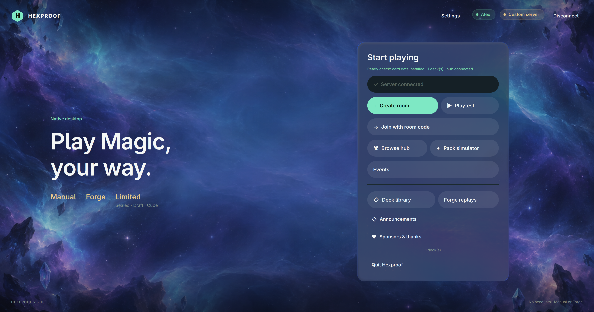
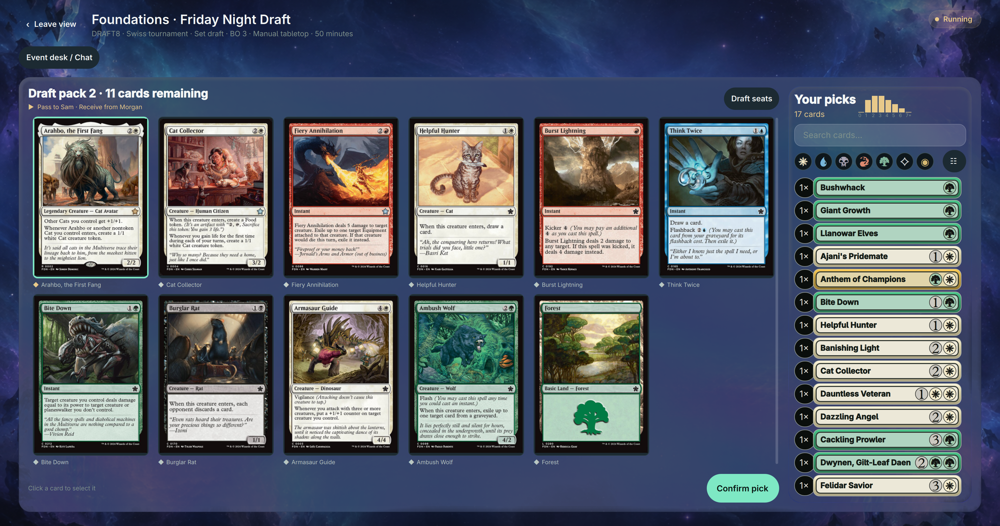
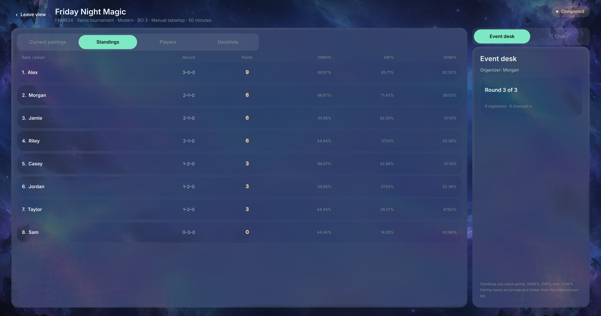
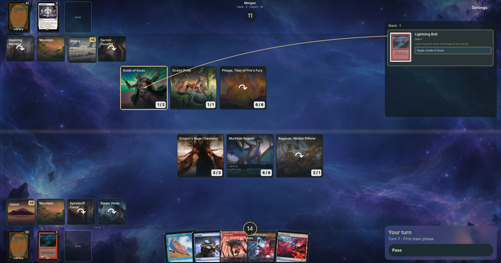
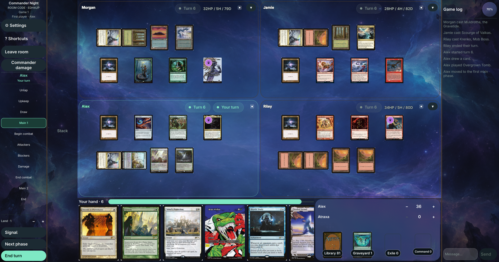

# Hexproof

Hexproof is a free, open-source desktop tabletop for **Magic: The Gathering**.
Bring friends together for a casual Commander night, draft a new deck, or run a
Swiss tournament—all in a native interface with glass surfaces and illustrated
backgrounds. Choose a manual table or let Forge handle the rules in supported
1v1 matches.

Available on **Windows, macOS, and Linux**, in **English and Simplified Chinese**.
No account required.

[Documentation and build guide](docs/guide/README.md)

## Screenshots

### Home

### Draft

### Swiss standings

### Forge duel

### Four-player Commander

## Ways to play

- **Manual tabletop:** 1v1 constructed, Duel Commander, and three- or four-player
  Commander/EDH. Move cards, declare combat, create tokens, and track counters,
  life, and commander damage. BO1 and BO3 with sideboarding are available where
  supported.
- **Forge rules:** Automated 1v1 constructed, Duel Commander, Set Sealed,
  Set Draft, and regular Cube matches, with legal actions, priority, triggers,
  and stack resolution. Revisit completed matches with visual replays.
- **Limited:** Set Draft and Cube Draft for two to eight players, six-pack
  Set Sealed, and Commander Cube with multiplayer tables. Build your deck from
  your pool, then take it into a match.
- **Swiss tournaments:** Run constructed or Limited events with check-in,
  pairings, match results, standings, and tiebreakers.
- **Solo practice:** Playtest decks or try the pack simulator. For 1v1
  constructed BO1, face Forge AI at Beginner, Normal, or Hard difficulty, or try
  experimental local and online model opponents.

## License

Hexproof is licensed under **GPL-3.0-or-later**; see [LICENSE](LICENSE).
Third-party work retains its applicable copyright notices. Forge attribution
and runtime notices are in [THIRD-PARTY-NOTICES.md](THIRD-PARTY-NOTICES.md).

Hexproof is unofficial fan software, unaffiliated with and not endorsed or
sponsored by Wizards of the Coast LLC or the Forge project. Magic: The Gathering,
card artwork, names, rules text, and related marks belong to their respective
owners.
